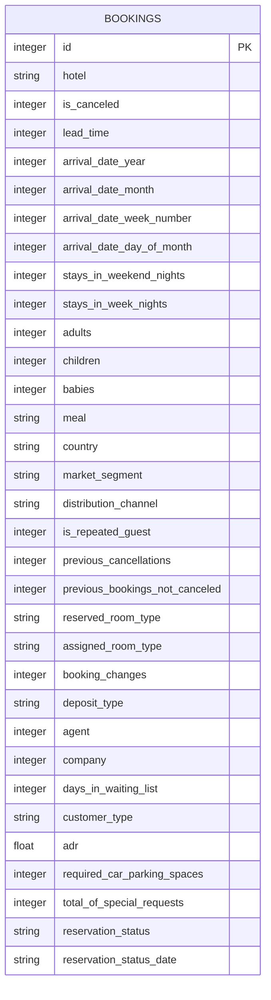

# 酒店预订智能管理系统 - 技术架构文档

## 1. 架构设计

```mermaid
graph TD
    subgraph "前端层"
        A[React应用]
    end
    
    subgraph "后端层"
        B[Flask后端API]
        C[机器学习预测服务]
    end
    
    subgraph "数据层"
        D[SQLite数据库]
        E[模型文件]
    end
    
    A --&gt; B
    B --&gt; D
    B --&gt; C
    C --&gt; E
```

## 2. 技术选型

- **前端**：React 18 + Tailwind CSS 3 + Vite
- **后端**：Flask (Python)
- **数据库**：SQLite (轻量级，便于部署)
- **机器学习**：scikit-learn
- **图表库**：ECharts / Matplotlib
- **初始化工具**：Vite

## 3. 目录结构

```
hotel-booking-system/
├── frontend/                 # 前端React应用
│   ├── src/
│   │   ├── components/
│   │   ├── pages/
│   │   ├── services/
│   │   └── App.jsx
│   └── package.json
├── backend/                  # 后端Flask应用
│   ├── app.py
│   ├── models/
│   │   ├── database.py
│   │   └── ml_models.py
│   ├── routes/
│   │   ├── bookings.py
│   │   └── prediction.py
│   └── requirements.txt
├── data/
│   └── hotel_bookings.csv
└── docs/
    ├── prd.md
    └── architecture.md
```

## 4. 路由定义

### 前端路由
| 路由 | 页面 |
|------|------|
| / | 数据管理页面 |
| /prediction | 预测页面 |
| /analytics | 统计分析页面 |

### 后端API路由
| 方法 | 路由 | 功能 |
|------|------|------|
| GET | /api/bookings | 获取预订列表 |
| GET | /api/bookings/&lt;id&gt; | 获取单个预订 |
| POST | /api/bookings | 创建新预订 |
| PUT | /api/bookings/&lt;id&gt; | 更新预订 |
| DELETE | /api/bookings/&lt;id&gt; | 删除预订 |
| POST | /api/predict | 预测单个预订 |
| POST | /api/predict/batch | 批量预测 |
| GET | /api/models/performance | 获取模型性能 |

## 5. 数据模型

### 5.1 实体关系图



### 5.2 数据库DDL

```sql
CREATE TABLE IF NOT EXISTS bookings (
    id INTEGER PRIMARY KEY AUTOINCREMENT,
    hotel TEXT,
    is_canceled INTEGER,
    lead_time INTEGER,
    arrival_date_year INTEGER,
    arrival_date_month INTEGER,
    arrival_date_week_number INTEGER,
    arrival_date_day_of_month INTEGER,
    stays_in_weekend_nights INTEGER,
    stays_in_week_nights INTEGER,
    adults INTEGER,
    children INTEGER,
    babies INTEGER,
    meal TEXT,
    country TEXT,
    market_segment TEXT,
    distribution_channel TEXT,
    is_repeated_guest INTEGER,
    previous_cancellations INTEGER,
    previous_bookings_not_canceled INTEGER,
    reserved_room_type TEXT,
    assigned_room_type TEXT,
    booking_changes INTEGER,
    deposit_type TEXT,
    agent INTEGER,
    company INTEGER,
    days_in_waiting_list INTEGER,
    customer_type TEXT,
    adr REAL,
    required_car_parking_spaces INTEGER,
    total_of_special_requests INTEGER,
    reservation_status TEXT,
    reservation_status_date TEXT
);
```

## 6. 机器学习模型设计

### 6.1 模型列表
1. **集成学习**：Random Forest（主要预测模型）
2. **逻辑回归**：Logistic Regression
3. **支持向量机**：SVM
4. **神经网络**：MLP (Multi-Layer Perceptron)

### 6.2 特征工程
- 缺失值处理
- 类别编码（Label Encoding / One-Hot Encoding）
- 数值标准化
- 特征选择（去除标签泄漏特征）

### 6.3 评估指标
- 准确率 (Accuracy)
- 精确率 (Precision)
- 召回率 (Recall)
- F1分数
- ROC-AUC

