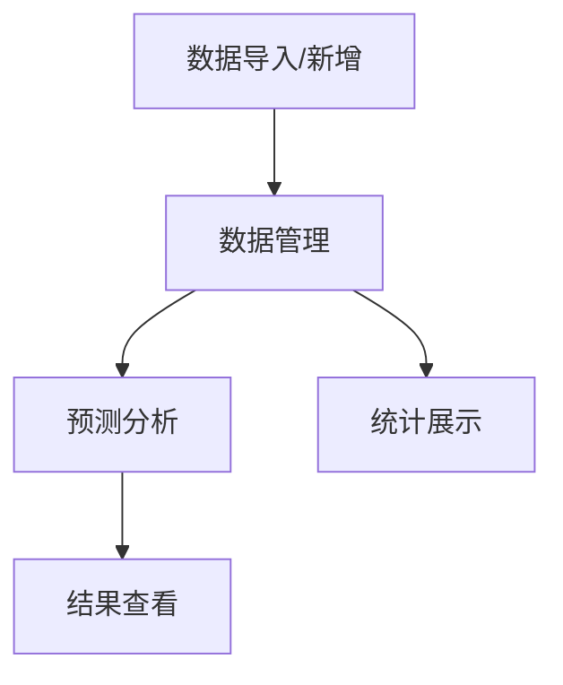

# 酒店预订智能管理系统 - 产品需求文档

## 1. 产品概述
本项目是一个完整的酒店预订智能管理系统，整合了机器学习预测模型和预订管理功能，旨在帮助酒店管理者提高预订管理效率和预测准确率。
- 核心目标：通过机器学习模型预测预订是否会取消，并提供完整的预订数据管理功能
- 市场价值：帮助酒店提前调整房源分配策略，减少损失，优化运营

## 2. 核心功能

### 2.1 用户角色
| 角色 | 注册方式 | 核心权限 |
|------|----------|----------|
| 管理员 | 系统预设 | 完整的增删改查、模型预测、数据统计功能 |

### 2.2 功能模块
1. **数据管理页面**：预订记录的增删改查
2. **预测页面**：单个预订预测和批量预测
3. **统计分析页面**：模型性能展示和数据分析
4. **数据导入页面**：批量导入预订数据

### 2.3 页面详情
| 页面名称 | 模块名称 | 功能描述 |
|----------|----------|----------|
| 数据管理 | 预订列表 | 分页展示所有预订记录，支持搜索和筛选 |
| 数据管理 | 新增预订 | 表单方式添加新的预订记录 |
| 数据管理 | 编辑预订 | 修改现有预订记录信息 |
| 数据管理 | 删除预订 | 删除不再需要的预订记录 |
| 预测页面 | 单个预测 | 输入预订信息，预测取消概率 |
| 预测页面 | 批量预测 | 上传文件，批量预测预订状态 |
| 统计分析 | 模型性能 | 展示四个模型的性能指标对比 |
| 统计分析 | 数据可视化 | 展示预订数据的关键统计图表 |

## 3. 核心流程

主要用户流程如下：
1. 管理员登录系统
2. 可以查看/编辑/删除现有的预订记录
3. 可以添加新的预订记录
4. 可以对预订进行取消预测
5. 可以查看模型性能和数据统计

## 4. 用户界面设计

### 4.1 设计风格
- 主色调：深蓝色 (#1E40AF) 和绿色 (#10B981)
- 按钮风格：圆角按钮，悬停效果
- 字体：Inter，16px 基础字号
- 布局：侧边栏导航 + 主内容区域
- 图标风格：线性图标，简洁明了

### 4.2 页面设计概述
| 页面名称 | 模块名称 | UI元素 |
|----------|----------|--------|
| 数据管理 | 预订列表 | 表格布局，筛选栏，操作按钮 |
| 预测页面 | 预测表单 | 卡片式表单，提交按钮，结果展示区域 |
| 统计分析 | 图表区域 | 多种图表类型，响应式布局 |

### 4.3 响应式设计
- 桌面优先，平板自适应，移动端支持
- 触摸操作优化

